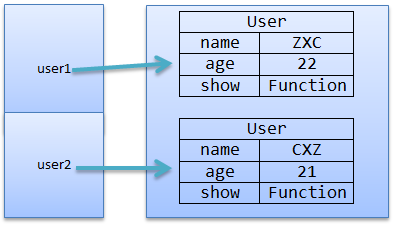
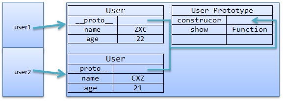

# JavaScript中的对象和原型

在[Javascript中的对象和原型(二)](http://kb.cnblogs.com/page/144405/)中我们提到，用构造函数创建的对象里面，每个对象之间都是独立的，这样就会降低系统资源的利用率，解决这样问题，我们就要用到下面提到的原型对象。

　　**一 原型对象**

　　原型对象实际上就是构造函数的一个实例对象，和普通的实例对象没有本质上的区别。可以包含特定类型的所有实例的共享属性或者方法。这样，如果我们需要修改所有实例中的属性或者方法，就只需要修改一处，就能够影响到所有实例了。因为原型中的属性和方法是共享的。我们可以看下两个图示：





　　从上面的图示中我们就不难看出，为何下面的代码中"user1.show == user2.show;"返回的是ture，因为show方法是所有由User构造函数创建的对象所共享的，而不是每个对象都各自创建了一个show方法。

　　每个JavaScript函数都有prototype属性，这个属性引用了一个对象，这个对象就是原型对象。原型对象初始化的时候是空的，我们可以在里面自定义任何属性和方法，这些方法和属性都将被该构造函数所创建的对象继承。

　　在原型中添加属性和方法可以参照如下代码：

```
function User(name,age){//构造方法
    this.name = name;//对象属性
    this.age = age;
}
User.prototype.addr = '湖北武汉';//在原型中添加属性
User.prototype.show = function(){//在原型中添加方法
    alert(this.name+'|'+this.age);    
};
var user1 = new User('ZXC',22);//创建实例
var user2 = new User('CXZ',21);
user1.show();//调用show()方法
user2.show();
alert(user1.show == user2.show);//返回 true 说明show方法是共享的
alert(user1.addr);//'湖北武汉'
alert(user2.addr);//'湖北武汉' 
```

　　但是有个问题是：如果我们既在构造方法中添加了一个属性、又在原型中添加了该属性，还在实例中添加了该属性，那么我们访问的究竟 是哪一个属性呢？我们先看看下面的代码：

```
function User(name,age){//构造方法
    this.name = name;//对象属性
    this.age = age;
    this.addr = '湖北恩施';
}
User.prototype.addr = '湖北武汉';//在原型中添加属性
var user1 = new User('ZXC',22);//创建实例
var user2 = new User('CXZ',21);
alert(user1.addr);//'湖北恩施'
delete user1.addr;//删除对象属性
alert(user1.addr);//'湖北武汉'
delete User.prototype.addr;
alert(user1.addr);//'undefined'
user2.addr = '武汉';
alert(user2.addr);//'武汉' 
```

　　从上面的代码可以看出，如果我们同时申明了对象属性、原型属性和实例属性，那么调用时显示的优先级应该是：实例属性>对象属性>原型属性。这就是采用了就近原则：调用时首先查找实例中是否直接定义了这个属性，有则返回实例属性；如果实例属性中没有就去构造函数中查找，有则返回；如果前面两者都没有就去原型对象中查找，如果没有则返回undefined。

　　**二 动态原型模式**

　　有人可能会觉得上面代码中的写法感觉很别扭，因为原型中的方法和属性与构造函数中定义的对象属性和方法不在一块儿，要是能封装在一起就更加直观，如果要解决这个问题，就要用到动态原型模式；

```
//动态原型模式
function User(name,age){//构造方法
    this.name = name;//属性
    this.age = age;
    this.addr = '湖北恩施';
    User.prototype.addr = '湖北武汉';//在原型中添加属性
    User.prototype.show = function(){//在原型中添加方法
        alert(this.name+'|'+this.age+'|'+this.addr);    
    };
}
var user1 = new User('ZXC',22);//创建实例
var user2 = new User('CXZ',21);
user1.show();//调用show()方法
user2.show();
alert(user1.show==user2.show);//返回 true 
```

　　上面的代码看起来要更加直观。但是这样还是会有一些小的问题，就是我们在创建多个实例的时候，没创建一个实例就会在原型中重新创建一次原型中的方法。先来测试一下：

```
alert('开始创建show……');
User.prototype.show = function(){//在原型中添加方法
    alert(this.name+'|'+this.age+'|'+this.addr);    
};
alert('结束创建show……'); 
```

　　如果我们添加上面的alert()，运行时发现，没创建一个实例都会弹出两次对话框。这就证明了上面提到的重新创建的问题，虽然这样来说空间没有额外增加，但是时间却是增加了，因为每次都要重新创建。

　　要解决这个问题，我们的思路是：首先判断show方法是否存在，如果不存在则创建，如果已经存在就不在重新创建。改进代码如下：

```
if(this.show==undefined){//如果run方法还没有被创建
    alert('开始创建show……');
    User.prototype.show = function(){//在原型中添加方法
        alert(this.name+'|'+this.age+'|'+this.addr);    
    };
    alert('结束创建show……');
} 
```

　　运行发现，不管创建多少个实例都只会弹出两次对话框，这样就避免了不必要的开销。

　　**三 使用字面量方式创建原型**

　　除了上面提到的创建原型的方式，我们还可以用字面量方式创建，代码如下：

```
//使用字面量方式创建原型
function User(name,age){//构造方法
    this.name = name;//属性
    this.age = age;
}
User.prototype = {
    addr : '湖北武汉',
    show : function(){
        alert(this.name+'|'+this.age+'|'+this.addr);
    }
};
var user1 = new User('ZXC',22);//创建实例
var user2 = new User('CXZ',21);
user1.show();//调用show()方法
user2.show(); 
```

​		这里要说明的是：使用字面量方式创建后，不能再使用**字面量**的方式重写原型，一旦重写了原型，原来的原型中定义的所有属性和方法都将被清除。如下：

```
//使用字面量方式创建原型
function User(name,age){//构造方法
    this.name = name;//属性
    this.age = age;
}
User.prototype = {
    addr : '湖北武汉',
    show : function(){
        alert(this.name+'|'+this.age+'|'+this.addr);
    }
};  
//重写了原型
User.prototype = {
    other : '暂时没有说明……',
    show : function(){
        alert(this.addr);    
    }
};    
var user1 = new User('ZXC',22);//创建实例
var user2 = new User('CXZ',21);
user1.show();//返回 undefined
user2.show(); 
```

　　可见，一旦我们重写了原型，那么开始原型中定义的变量和方法都没有保存下来。但是，我们说的是不能用字面量的方式重写原型，那我们可不可以添加新的方法或者属性呢？答案是可以的，比如：

```
User.prototype.addr1 = '武汉'; 
```

这样就不会清楚原来原型中定义的方法和属性了。

　**四 总结**

　　这里主要是介绍了原型的一些基本的知识，原型可以用来实现方法和属性的共享，也可以用来扩展对象的方法。比如我们可以用原型方法来扩展内置对象String的方法，让它具有VB的left()/right()功能，是实现截取字符串左边或者右边的功能。


## 转载：