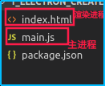

# 主进程与渲染进程

## 1.主进程和渲染器进程

- Electron 运行 package.json 的 main 脚本的进程被称为主进程。 在主进程中运行的脚

本通过创建 web 页面来展示用户界面。 一个 Electron 应用总是有且只有一个主进程。

- 由于 Electron 使用了 Chromium (谷歌浏览器) 来展示 web 页面,所以 Chromium 的

多进程架构也被使用到。 每个 Electron 中的 web 页面运行在它自己的渲染进程中。

- 主进程使用 BrowserWindow 实例创建页面。每个 BrowserWindow 实例都在自己的渲

染进程里运行页面。 当一个 BrowserWindow 实例被销毁后,相应的渲染进程也会被终止。



## 2.主进程与渲染进程使用nodejs

详情开代码.

注意:创建BrowserWindow时,要加入如下属性,不然在渲染进程中无法调用nodejs.

```
webPreferences: {
        nodeIntegration: true
}
```

