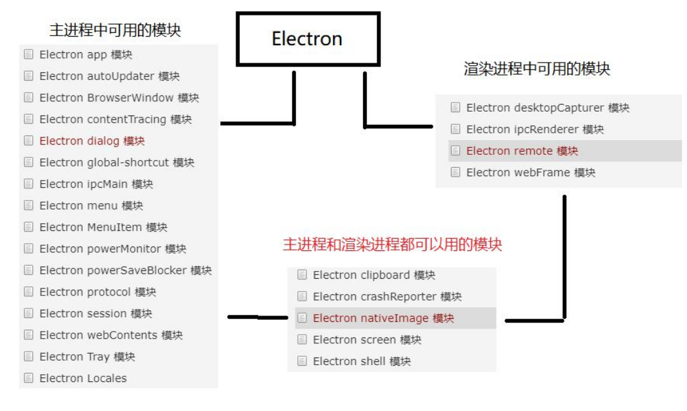

# remote模块使用与BW打开新窗口

## 1.electron中的模块

在electron中可分为三类模块:

- 只能在主进程中使用的模块
- 只能在渲染进程中使用的模块
- 主进程与渲染进程中都能使用的模块

如图所示:




## 2.remote模块使用

**remote 模块提供了一种在渲染进程(网页)和主进程之间进行进程间通讯(IPC)的简便途径**,Electron 中, 与 GUI 相关的模块(如 dialog, menu 等)只存在于主进程,而不在渲染进程中 。为了能从渲染进程中使用它们,需要用 ipc 模块来给主进程发送进程间消息。使用 remote 模块,可以调用主进程对象的方法,而无需显式地发送进程间消息,这类似于 Java 的 RMI。

### 2.1渲染进程通过remote打开窗口 

Electron 渲染进程中通过 remote 模块调用主进程中的BrowserWindow 打开新窗口.

在渲染进程中引入:BrowserWindow,并创建窗口.

```
var BrowserWindow=require('electron').remote.BrowserWindow;
```

详情开代码.

