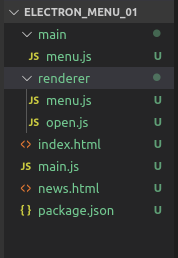

# 自定义顶部菜单与右键菜单

## 1.electron自定义软件顶部菜单以及绑定快捷键

Electron 中 Menu 模块可以用来创建原生菜单,它可用作应用菜单和 context 菜单。这个模块是一个主进程的模块,并且可以通过 remote 模块给渲染进程调用。也可以在主线程中直接调用require('./main/menu.js');

```
// menu.js
var remote=require('electron').remote;

const Menu=remote.Menu;


//定义菜单
var template=[
    {

        label:'文件',
        submenu:[
            {
                label:'新建文件',

                accelerator:'ctrl+n',

                click:function(){ 
                    console.log('ctrl+n');
                }
            },
            {

                label:'新建窗口',
                click:function(){ 

                    console.log('new window');
                }
            }
        ]
    },
    {

        label:'编辑',
        submenu:[
            {

                label:'复制11',
                role:'copy'
            },
            {
                label:'截切',
                role:'cut'
            }
        ]
    }
]

var m=Menu.buildFromTemplate(template);

Menu.setApplicationMenu(m);

```

- 并在渲染进程index.html中调用 `<script src="renderer/open.js"></script>` .或者在主线程中调用:`require('./main/menu.js');`
- 快捷键设置:`accelerator:'ctrl+n'`

目录结构:




## 2.自定义右键

```
//右键菜单

window.addEventListener('contextmenu',function(e){
    //阻止当前窗口默认事件
    e.preventDefault();

    //在当前窗口点击右键的时候弹出  定义的菜单模板
    m.popup({window:remote.getCurrentWindow()})

},false)
```

