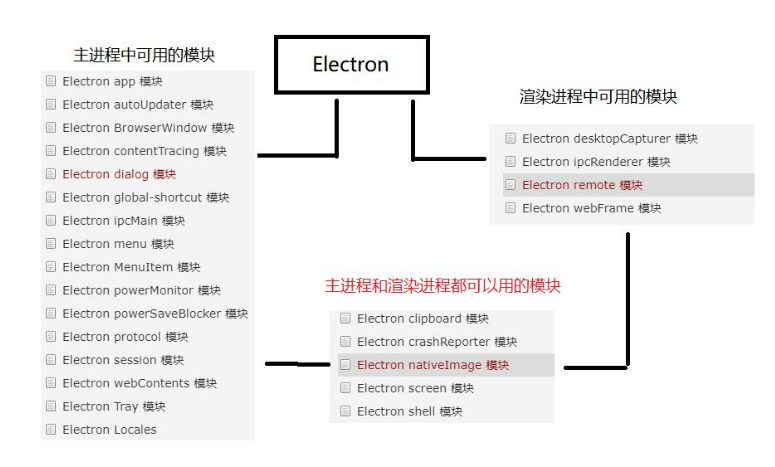

# 主线程与渲染进程通信



Electron中主进程与渲染进程通讯主要用到两个模块:ipcMain和ipcRenderer

- ipcMain:当在主进程中使用时候,它处理从渲染进程(网页)发送出来的异步和同步信息,当然也可以从主进程向渲染进程发送消息;
- ipcRenderer:使用他提供的一些方法从渲染进程(web页面)发送同步或者异步的消息的到主进程,也可以接收主进程的回复消息.

## 1. electron渲染进程通过localstorage给另外一个渲染进程传值

```
localStorage.setItem(key,value);
localStorage.getItem(key);
```

## 2. 通过 BrowserWindow 和 webContents 模块实现渲染进程和渲染进程的通信

webContents 是一个 事件发出者.它负责渲染并控制网页,也是 BrowserWindow 对象的属
性。

- 获取当前窗口的id:

```
const winId = BrowserWindow.getFocusedWindow().id;
```

- 监听当前窗口加载完成的事件

```
win.webContents.on('did-finish-load',(event) => {

})
```

- 同一个窗口之间广播数据

```
win.webContents.on('did-finish-load',(event) => {
	win.webContents.send('msg',winId,'我是 index.html 的数据');
})
```

- 通过id查找窗口

```
let win = BrowserWindow.fromId(winId);
```

