# electon 入门

## 1. electron-vue创建

- https://simulatedgreg.gitbooks.io/electron-vue/cn/

## 2. electron进程

electron分为渲染进程和主进程

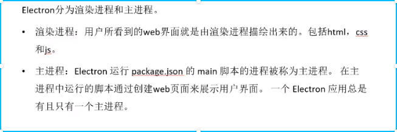

## 3.调试

渲染进程调试和主进程调试.

- 渲染进程的调试就是我们熟悉的网页调试.
- 主进程调试:

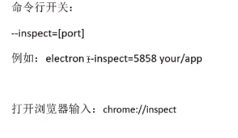

vscode下主进程调试:

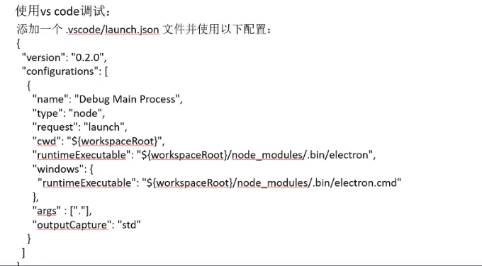

## 4.事件

在main.js中获取到APP,在APP中有很多事件.例如:

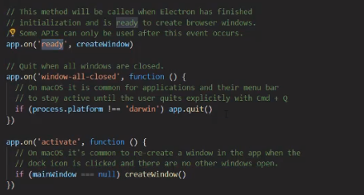

### 4.1 APP常用事件

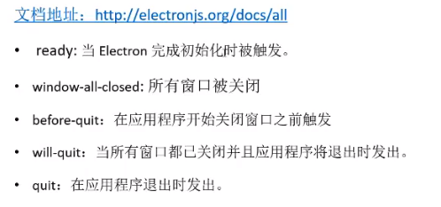

### 4.2 webContents常用事件

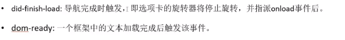

## 5.进程对象

官方给出的进程API:

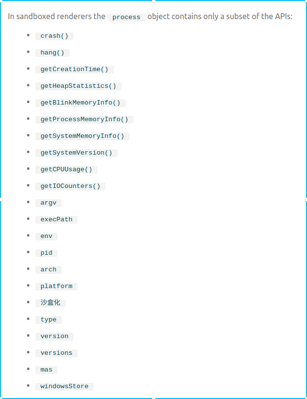

通过这些函数可以获取电脑的CPU运行状态,运行的平台,内存使用的情况等等.

例如:在index.html中写,getprocessInfo()

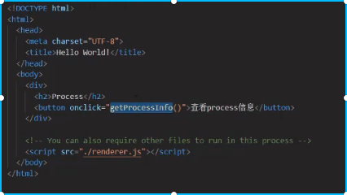

然后在renderer.js中写getprocessInfo函数,然后在index.html中既可以调用,在getprocessInfo中调用进程的信息.

这个过程中渲染进程调用renderer.js为渲染进程的js,main.js为主进程的js.

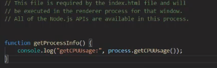

## 6.file对象

> 在文件系统中，使用HTML5 `File` 原生API操作文件

DOM的文件接口提供了关于原生文件的抽象，以便用户可以直接使用HTML5文件API处理原生文件。 Electron已经向 `文件` 接口添加了一个 `path` 属性, 在文件系统上暴露出文件的真实路径

示例：获取拖拽到app上的文件的真实路径

```
<div id="holder">
  Drag your file here
</div>

<script>
  document.addEventListener('drop', (e) => {
    e.preventDefault();
    e.stopPropagation();

    for (const f of e.dataTransfer.files) {
      console.log('File(s) you dragged here: ', f.path)
    }
  });
  document.addEventListener('dragover', (e) => {
    e.preventDefault();
    e.stopPropagation();
  });
</script>
```

例如,拖动文件到窗口中,并把文件的内容读取出来:

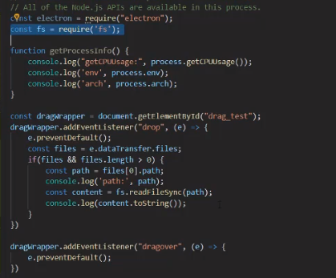

## 7. webview标签

相当于把一个网页嵌入到客户程序里面.在webview中可以加载脚本,css等. 

应用:例如有一个网页需要经常修改,但是在客户端中需要显示,那么我们不需要每次修改网页都要对客户端进行修改,只需要把该网页嵌入到客户端就可以了.

### 警告

Electron的 `webview` 标签基于 [Chromium webview  ](https://developer.chrome.com/apps/tags/webview)，后者正在经历巨大的架构变化。 这将影响 `webview` 的稳定性，包括呈现、导航和事件路由。 我们目前建议不使用 `webview` 标签，并考虑其他替代方案，如 `iframe` 、Electron的 `BrowserView` 或完全避免嵌入内容的体系结构。

在使用的时候需要注意版本的问题,有些版本需要设置一些变量才能够是使用.

### 7.1 概览

> 在一个独立的 frame 和进程里显示外部 web 内容。

进程: [Renderer](https://electronjs.org/docs/glossary#renderer-process)

使用 `webview` 标签在Electron 应用中嵌入 "外来" 内容 (如 网页)。外来"内容包含在 `webview` 容器中。 应用中的嵌入页面可以控制外来内容的布局和重绘。

与 `iframe` 不同, `webview` 在与应用程序不同的进程中运行。它与您的网页没有相同的权限, 应用程序和嵌入内容之间的所有交互都将是异步的。 这将保证你的应用对于嵌入的内容的安全性。 **注意:** 从宿主页上调用 webview 的方法大多数都需要对主进程进行同步调用。

## 8.窗口

使用window.open 可以弹出新的窗口.

### 8.1 子父窗口信息传递

- 发送消息给父窗口:

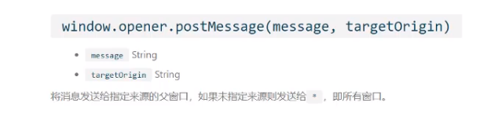

可以通过子窗口倍消息发送给 父窗口,例如:

子窗口代码:

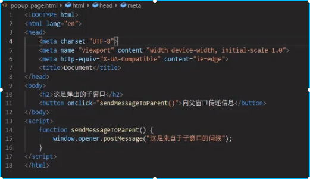

父窗口代码:

**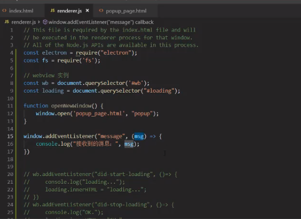**

运行:

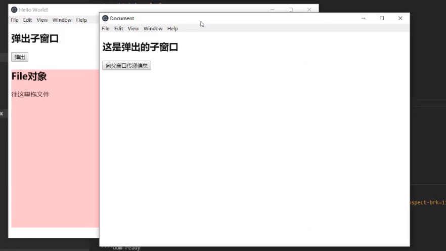


### 8.2 关闭子窗口

使用BrowserWindowProxy类对象.

> 操纵子浏览器窗口

进程: [渲染进程](https://electronjs.org/docs/glossary#renderer-process)

使用 `window.open` 创建一个新窗口时会返回一个 `BrowserWindowProxy`对象，并提供一个有限功能的子窗口.

## 9 browserWindow

可以使用browserWindow创建一个窗口,使用frame来控制是否需要边框,例如:

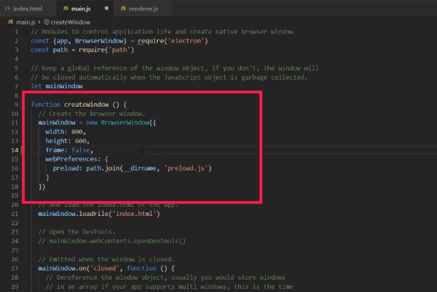

- ready-to-show事件:

在加载页面时,渲染进程第一次绘制时,会发出ready-to-show事件在此事件后显示窗口将没有视觉闪烁.